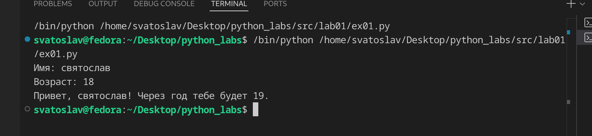
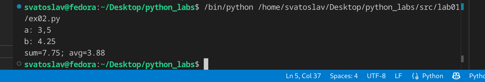
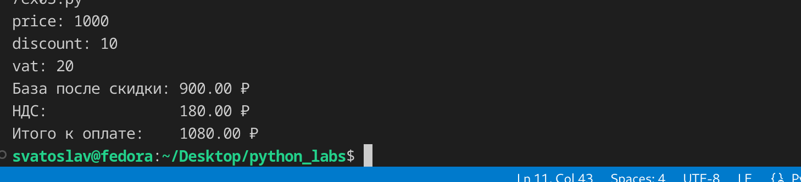
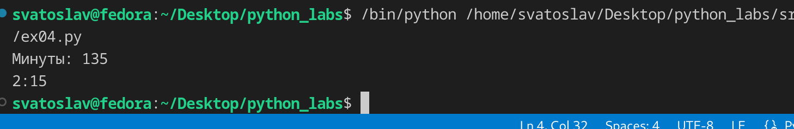
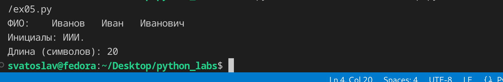
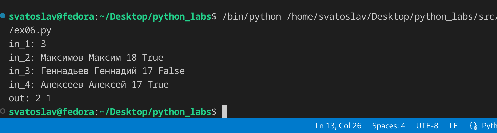
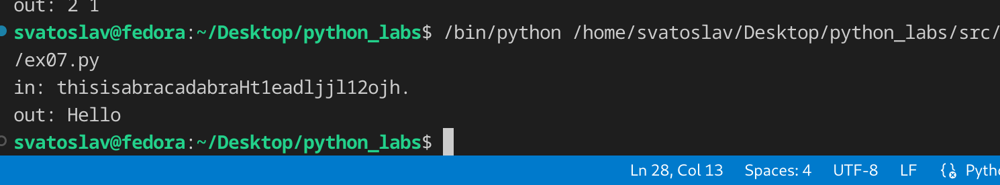

## ЛР1 — Ввод/вывод и форматирование

### Задание 1

Запрашивает(input) имя и возраст и выводит(print) информацию

### Задание 2

Запрашивает(input) два вещественных числа(float) меняет запятые(если есть) на точки(replace) и воводит до двух знаков после запятой(:.2f)

### Задание 3

Запрашивает(input) значения, считает ндс и скидку и сумму.

### Задание 4

Запрашивает(input) целое число(int) преабразует в формат часов(:02d)

### Задание 5

Запрашивает(input) фио с пробелами. убираем лишние пробелы(split), берет(через цикл) каждую первую буквы и делает ее заглавной, соединяем все части фио одни пробелом(join)

### Задание 6

Запрашивает(input) количество строк и перебираем вводы, split делим и получаем, имя фамилию, форму обучение и т.д. считаем количесво очных и заочных и выводим

### Задание 7

Запрашивает(input) строку s, перебирает её и находит индекс первой заглавной буквы (start), через rfind находит индекс последней точки (end), снова перебирает и находит индекс символа сразу после первой цифры (second), считает шаг step = second - start, потом в цикле while идёт от start до end с этим шагом, собирает символы в список result, убирает точку в конце через pop и выводит склеенную строку через join.

