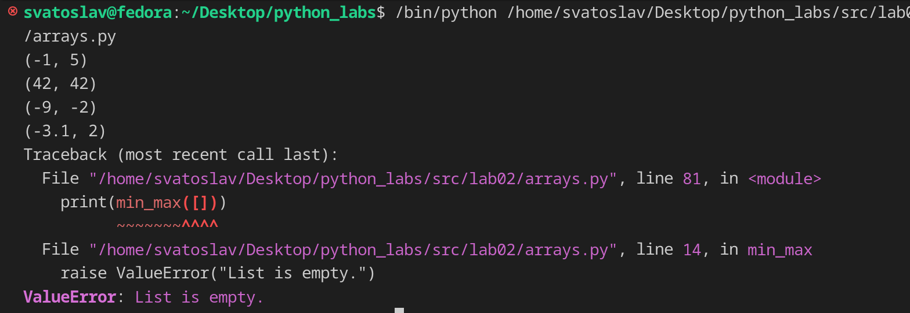
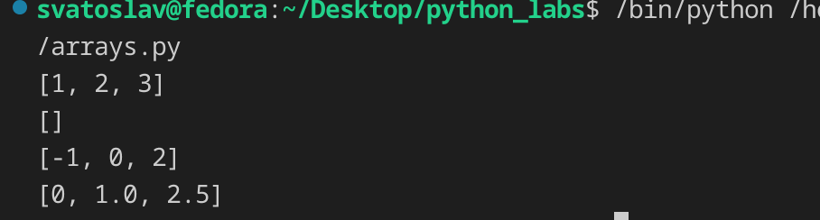
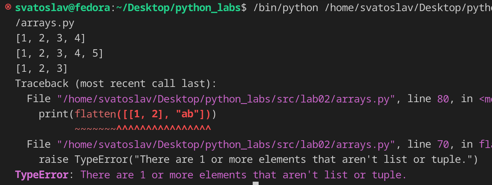
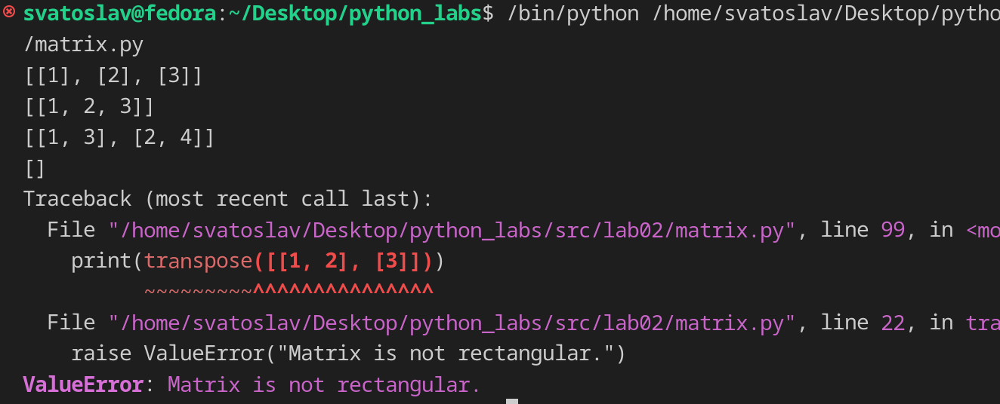
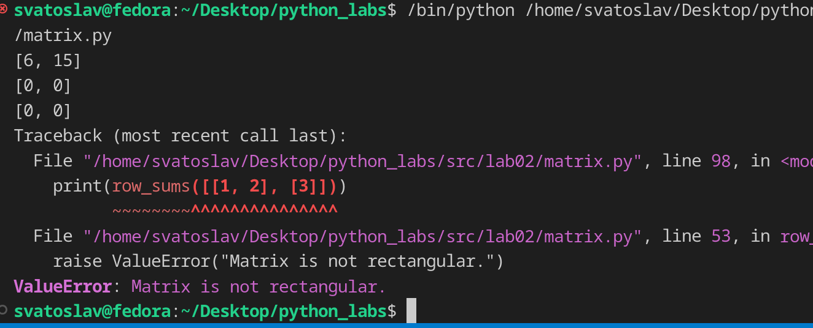
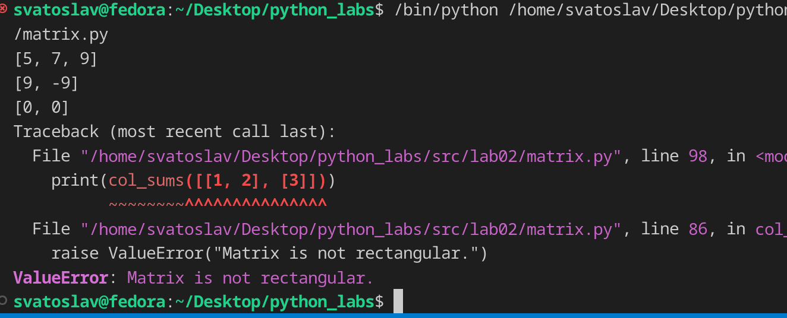
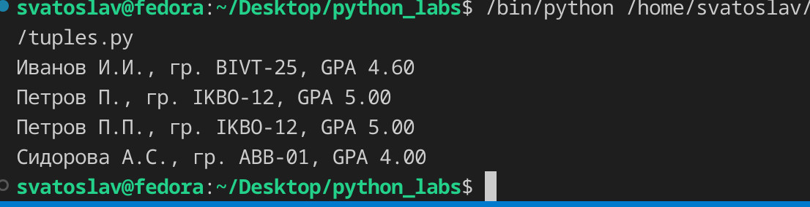

## ЛР2 — Коллекции и матрицы (list/tuple/set/dict)

## Задание 1
### функция min_max

функция за один проход по списку находит минимальный и максимальный элементы. За начальные значения минимума и максимума берётся первый элемент списка, затем каждый последующий элемент сравнивается с ними и при необходимости обновляет их. 

```py
def min_max(nums: list[float | int]) -> tuple[float | int, float | int]:
    """Return a tuple (minimum, maximum) from a list of numbers.

    Args:
        nums: list [float or int]

    Returns:
        Type: tuple [float | int, float | int]

    Raises:
        ValueError: List is empty.
    """
    if not nums:
        raise ValueError("List is empty.")

    minimum = nums[0]
    maximum = nums[0]

    for value in nums[1:]:
        if value < minimum:
            minimum = value
        if value > maximum:
            maximum = value

    return minimum, maximum

print(min_max([3, -1, 5, 5, 0]))
print(min_max([42]))
print(min_max([-5, -2, -9]))
print(min_max([1.5, 2, 2.0, -3.1]))
print(min_max([]))    
```




### функция unique_sorted

функция возвращает новый список, содержащий только уникальные значения из исходного списка, отсортированные по возрастанию. Сначала формируется список уникальных элементов: каждое число добавляется только в том случае, если его ещё нет в результирующем списке (проверка через in). Затем полученный список сортируется пузырёком — попарным сравнением соседних элементов с обменом местами.  

```py
def unique_sorted(nums: list[float | int]) -> list[float | int]:
    """Return a list of unique values ​​sorted in ascending order.

    Args:
        nums: list [float | int]

    Returns:
        A new list containing only unique values, sorted in ascending order.
        Type: list [float | int]
    """

    unique: list[float | int] = []
    for value in nums:
        if value not in unique:
            unique.append(value)

    n = len(unique)
    for i in range(n - 1):
        for j in range(n - 1 - i):
            if unique[j] > unique[j + 1]:
                unique[j], unique[j + 1] = unique[j + 1], unique[j]

    return unique

print(unique_sorted([3, 1, 2, 1, 3]))
print(unique_sorted([]))
print(unique_sorted([-1, -1, 0, 2, 2]))
print(unique_sorted([1.0, 1, 2.5, 2.5, 0]))  
```



### функция flatten

функция расплющивает список списков или кортежей в один плоский список, обходя элементы построчно (row-major). Для каждого элемента верхнего уровня проверяется, что он является списком или кортежем: если это не так (например, строка или число), возбуждается исключение TypeError. Затем все вложенные элементы по порядку добавляются в результирующий список, который и возвращается. 

```py
def flatten(mat: list[list | tuple]) -> list:
    """Flatten a list of lists/tuples into a single list (row-major).

    Args:
       mat: list [list | tuple]

    Returns:
        Flatten list.
        Type: list

    Raises:
        TypeError: Unexpected 1 or more elements that aren't list or tuple.
    """
    result: list = []

    for row in mat:
        if not isinstance(row, (list, tuple)):
            raise TypeError("There are 1 or more elements that aren't list or tuple.")
        for item in row:
            result.append(item)

    return result


print(flatten([[1, 2], [3, 4]]))
print(flatten([[1, 2], (3, 4, 5)]))
print(flatten([[1], [], [2, 3]]))
print(flatten([[1, 2], "ab"]))
```




## Задание 2
### функция transpose

функция меняет строки и столбцы прямоугольной матрицы местами: элемент mat[i][j] переходит в позицию [j][i]. Сначала обрабатывается пустая матрица, затем проверяется прямоугольность — если строки разной длины, возбуждается ValueError. Транспонирование выполняется двойным циклом: внешний идёт по столбцам, внутренний — по строкам, собирая элементы mat[r][c] в новую строку результата

```py
def transpose(mat: list[list[float | int]]) -> list[list]:
    """Transpose a rectangular matrix (swap rows and columns).

    Args:
        mat: list [ list [float | int] ]

    Returns:
        New matrix where rows and columns are swapped.
        Type: list[list]

    Raises:
        ValueError: If matrix is not rectangular.
    """
    if not mat:
        return []

    rows = len(mat)
    cols = len(mat[0])

    for row in mat:
        if len(row) != cols:
            raise ValueError("Matrix is not rectangular.")

    result: list[list] = []
    for c in range(cols):
        new_row: list = []
        for r in range(rows):
            new_row.append(mat[r][c])
        result.append(new_row)

    return result

print(transpose([[1, 2, 3]]))
print(transpose([[1], [2], [3]]))
print(transpose([[1, 2], [3, 4]]))
print(transpose([]))
print(transpose([[1, 2], [3]]))
```



### функция row_sums

функция принимает прямоугольную матрицу и возвращает список сумм элементов каждой строки. Сначала обрабатывается пустая матрица, затем проверяется прямоугольность — если строки разной длины, возбуждается ValueError. Далее для каждой строки вручную накапливается сумма её элементов с помощью цикла и считается сумма, и результат добавляется в итоговый список, который возвращается из функции.

```py
def row_sums(mat: list[list[float | int]]) -> list[float]:
    """Return a list with the sum of each row of a rectangular matrix.

    Args:
        mat: list[ list [float | int] ]

    Returns:
        List of row sums.
        Type: list[float]

    Raises:
        ValueError: If matrix is not rectangular.
    """
    if not mat:
        return []

    cols = len(mat[0])
    for row in mat:
        if len(row) != cols:
            raise ValueError("Matrix is not rectangular.")

    result: list[float] = []
    for row in mat:
        total = 0
        for value in row:
            total += value
        result.append(total)

    return result

print(row_sums([[1, 2, 3], [4, 5, 6]]))
print(row_sums([[-1, 1], [10, -10]]))
print(row_sums([[0, 0], [0, 0]]))
print(row_sums([[1, 2], [3]]))
```



### функция col_sums

функция  принимает прямоугольную матрицу и возвращает список сумм элементов каждого столбца. Сначала обрабатывается пустая матрица, затем проверяется прямоугольность — если строки разной длины, возбуждается ValueError. Для накопления сумм создаётся список result длиной cols, заполненный нулями. Затем двойным циклом проходим по всем элементам: внешний цикл по строкам, внутренний по столбцам, и каждый элемент mat[r][c] прибавляется к result[c]. Встроенная sum() не используется. В конце возвращается список сумм по столбцам.

```py
def col_sums(mat: list[list[float | int]]) -> list[float]:
    """Return a list with the sum of each column of a rectangular matrix.

    Args:
        list[ list [float | int] ]

    Returns:
        List of column sums.
        Type: list [float]

    Raises:
        ValueError: If matrix is not rectangular.
    """
    if not mat:
        return []

    rows = len(mat)
    cols = len(mat[0])

    for row in mat:
        if len(row) != cols:
            raise ValueError("Matrix is not rectangular.")

    result: list[float] = [0] * cols
    for r in range(rows):
        for c in range(cols):
            result[c] += mat[r][c]

    return result


print(col_sums([[1, 2, 3], [4, 5, 6]]))
print(col_sums([[-1, 1], [10, -10]]))
print(col_sums([[0, 0], [0, 0]]))
print(col_sums([[1, 2], [3]]))
```



## Задание 3

функция принимает кортеж вида (fio, group, gpa) и возвращает отформатированную строку "Фамилия И.О., гр. GROUP, GPA X.XX". В начале кортеж распаковывается на три переменные: fio, group, gpa. Затем ФИО очищается от лишних пробелов по краям (strip) и разбивается на части (split); если частей меньше двух, возбуждается ValueError. Фамилия приводится к нормальному виду через capitalize() — первая буква заглавная, остальные строчные. Из имени и отчества формируются инициалы: берётся первая буква каждой части, переводится в верхний регистр и дополняется точкой, после чего все инициалы склеиваются через join. Группа также очищается от лишних пробелов и внутренних повторов через strip + split + join. В конце возвращается итоговая строка, где GPA выводится с двумя знаками после запятой с помощью форматирования f"{gpa:.2f}".

```py
def format_record(rec: tuple[str, str, float]) -> str:
    """Format a student record as a human-readable string.

    Args:
        rec: tuple[str, str, float]

    Returns:
        Formated string from tuple.
        Type: str.

    Raises:
        ValueError: If fio contains fewer than 2 parts.
        TypeError: If rec is not a tuple of three elements.
    """
    fio, group, gpa = rec
    fio_parts = fio.strip().split()

    if len(fio_parts) < 2:
        raise ValueError("FIO must contain at least surname and name.")

    surname = fio_parts[0].capitalize()

    initials = "".join(part[0].upper() + "." for part in fio_parts[1:])

    group_clean = " ".join(group.strip().split())

    return f"{surname} {initials}, гр. {group_clean}, GPA {gpa:.2f}"


print(format_record( ("Иванов Иван Иванович", "BIVT-25", 4.6) ))
print(format_record( ("Петров Пётр", "IKBO-12", 5.0) ))
print(format_record( ("Петров Пётр Петрович", "IKBO-12", 5.0) ))
print(format_record( ("  сидорова  анна   сергеевна ", "ABB-01", 3.999) ))
```

