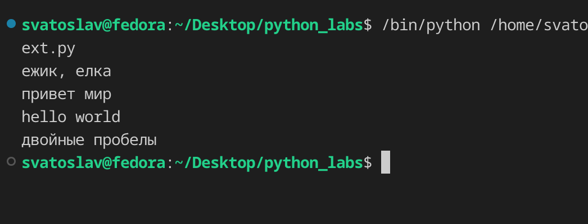
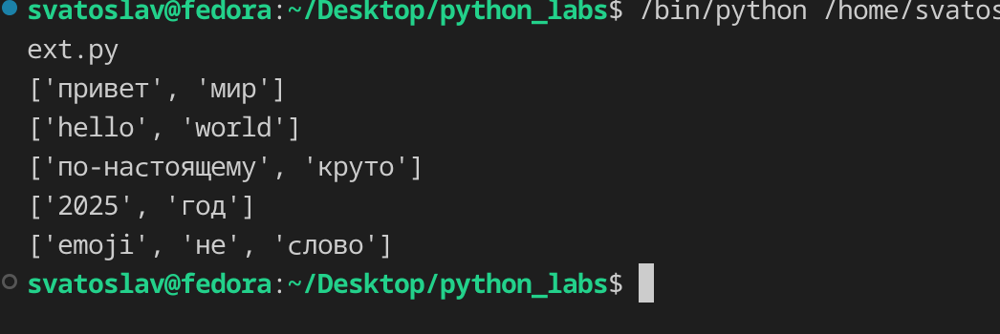
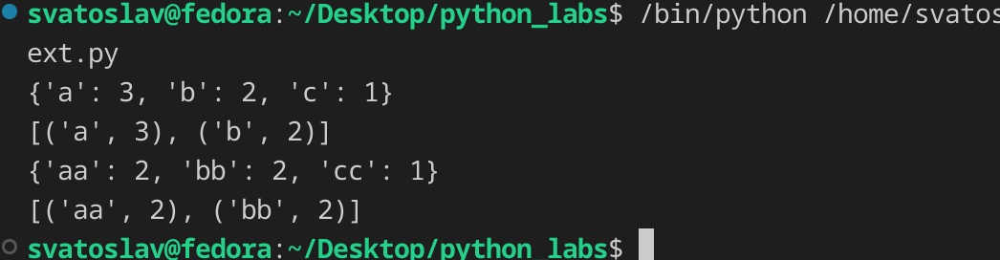
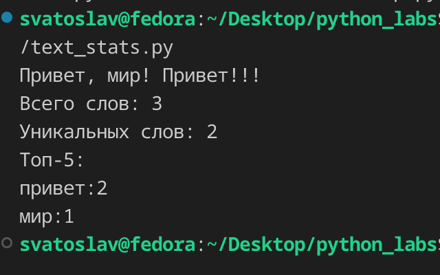

## ЛР3 — Тексты и частоты слов (словарь/множество)

## Задание 1
### функция normalize

Приводит текст к нормальному виду: переводит в нижний регистри заменяет «ё» на «е», затем заменяет все пробельные символы (\t, \r, \n) на пробелы, схлопывает повторяющиеся пробелы в один и обрезает края. Возвращает нормализованную строку.

```py
def normalize(text: str, *, casefold: bool = True, yo2e: bool = True) -> str:
    """
    This function normalizes input text.

    Args:
        text: str,
        *
        casefold: bool = True
        yo2e: bool = True

    Returns:
        Normalized text.
        Type: str

    Tests:
        assert normalize("ПрИвЕт\nМИр\t") == "привет мир"
        assert normalize("ёжик, Ёлка") == "ежик, елка"
    """

    if casefold: 
        text = text.casefold()
    if yo2e: 
        text = text.replace("ё", "e").replace("Ё", "Е")
    text = text.replace("\t", " ").replace("\r", " ").replace("\n", " ")
    while "  " in text: 
        text = text.replace("  ", " ")
    return text.strip()

print(normalize("ёжик, Ёлка"))
print(normalize("ПрИвЕт\nМИр\t"))
print(normalize("Hello\r\nWorld"))
print(normalize("  двойные   пробелы  "))
 
```




### функция tokenize

функция возвращает новый список, содержащий только уникальные значения из исходного списка, отсортированные по возрастанию. Сначала формируется список уникальных элементов: каждое число добавляется только в том случае, если его ещё нет в результирующем списке (проверка через in). Затем полученный список сортируется пузырёком — попарным сравнением соседних элементов с обменом местами.  

```py
def tokenize(text: str) -> list [str]:
    """
    This function tokenizes input (normalized) text.

    Args: 
        text: str

    Returns:
        List of tokens.
        Type: list [str]

    Tests:
        assert tokenize("привет, мир!") == ["привет", "мир"]
        assert tokenize("по-настоящему круто") == ["по-настоящему", "круто"]
        assert tokenize("2025 год") == ["2025", "год"]
    """
    tokens = re.findall(r"\w+(?:-\w+)*", text)
    return tokens
```



### функция count_freq и top_n

1. Подсчитывает частоту каждого токена в списке. Возвращает словар.
2. Принимает словарь частот и число n. Сортирует пары (токен, частота) по убыванию частоты и возвращает первые n в виде списка кортежей.

```py
def count_freq(tokens: list[str]) -> dict [str, int]:
    """
    It counts frequencies for tokens.

    Args:
        tokens: list[str]

    Returns:
        List of frequencies for tokens.
            Type: dict [str, int]

    Tests:
        freq = count_freq(["a","b","a","c","b","a"])
        assert freq == {"a":3, "b":2, "c":1}
    """
    sl = {}
    for i in sorted(tokens):
        cl = tokens.count(i)
        sl.update({i: cl})
    return sl

def top_n(freq: dict[str, int], n: int = 5) -> list [ tuple [str, int] ]:
    """
    It returns TOP-n of tokens by frequencies.

    Args:
        freq: dict[str, int]
        n: int = 5

    Returns:
        TOP-n.
            Type: list [ tuple [str, int] ]

    Tests:
        1.
            freq = count_freq(["a","b","a","c","b","a"])
            assert freq == {"a":3, "b":2, "c":1}
            assert top_n(freq, 2) == [("a",3), ("b",2)]
        2.
            freq2 = count_freq(["bb","aa","bb","aa","cc"])
            assert top_n(freq2, 2) == [("aa",2), ("bb",2)]
    """
    items = [i for i in freq.items()]
    items.sort(key=lambda x: x[1], reverse=True)
    return items[:n]

print(count_freq(["a","b","a","c","b","a"]))
print(top_n( count_freq(["a","b","a","c","b","a"]), n=2 ))
print(count_freq(["bb","aa","bb","aa","cc"]))
print(top_n( count_freq(["bb","aa","bb","aa","cc"]), n=2 ))

```




## Задание 2
### text_stats

Программа читает текст из стандартного ввода, нормализует его, разбивает на токены и подсчитывает частоты слов. Затем выводит общее количество слов, количество уникальных слов и топ-5 самых частых.

```py
import os
from sys import path, stdin
path.insert(0, os.path.join(os.path.dirname(__file__), '..', '..'))
from src.lib.text import *

text = stdin.read()
text_nrm = normalize(text)
tokens = tokenize(text_nrm)
freqs = count_freq(tokens)
top_5 = top_n(freqs, 5)

print(f"Всего слов: {len(tokens)}\nУникальных слов: {len(freqs.keys())}\nТоп-5:")
```


